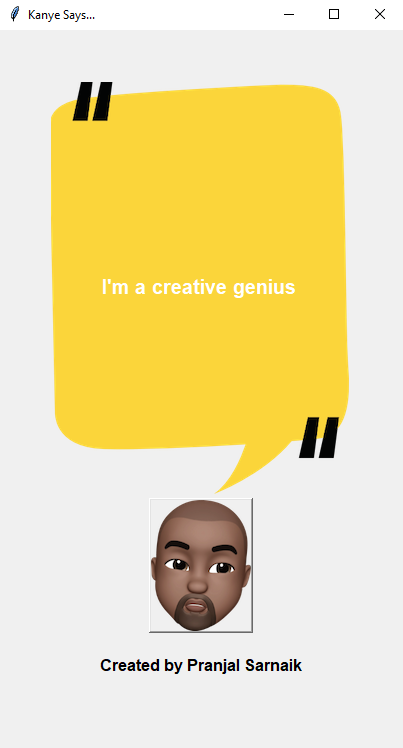

# Kanye Quotes
A fun project that displays random quotes from Kanye West using the **Kanye.rest** API. Each time the user clicks the button, a new quote is fetched from the API and displayed on a beautifully designed Tkinter GUI window.  

## Screenshots


## Author
Pranjal Sarnaik

## Features
- **Dynamic Quote Display**: Displays a random Kanye West quote fetched from the **Kanye.rest** API.  
- **Interactive Button**: A clickable button that fetches a new quote dynamically.  
- **User-Friendly GUI**: A visually appealing interface with custom images and fonts.  
- **Attribution Label**: Displays "Created by Pranjal Sarnaik" at the bottom of the application.  

## Level
Intermediate

## Tech Stack
Python | Tkinter GUI | API Integration | Python Functions | Python Development | GUI Applications  

## How to Run
1. Clone the repo:  
   ```bash  
   git clone https://github.com/pranjalco/kanye-quotes-.git

2. Run(Also install required libraries):
    ```bash  
   pip install requests  
   python app.py

**Created by Pranjal Sarnaik**  
*Released under the MIT License*